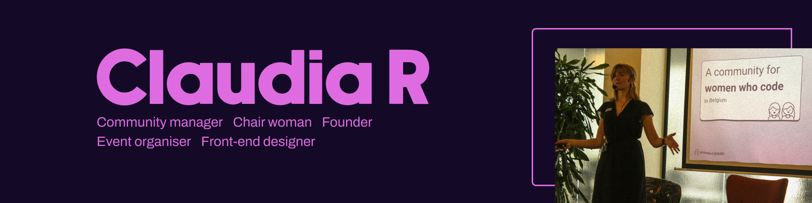

 

## **Short intro**
<table style="border:none">
<tr>
  <td style="vertical-align: top">
    
  </td>
  <td>
  </td>
  <td>

👩‍⚖️  Chairwoman [@fronteers](https://github.com/fronteers) && event organiser [@fronteersbe](https://github.com/fronteersbe)

💁‍♀️  Founder & editor [@womendotcodebe](https://womendotcode.be)

👩‍💻  Front-end Designer (A11Y, UX & UI design, static websites, sustainable design & development) 

🎮  Anime, board & video game enthusiast 🤓 overall geek 👩🏻‍🎤

😻  Loving cats, 🍹 Tiki bars, 🌳 Forests

🌱 Part of the movement to increase Diversity, Inclusion, Accessibility and Sustainability in tech 
  </td>
</tr>
</table>

## **Long intro**

Hi there 👋! 
I am Claudia, a hearing impaired (🦻) community builder and founder, who wants to make the tech industry more accessible and inclusive. The last seven years I have been spending a lot of time and energy on a goal that is close to my heart: To support women in tech and increasing visibility for local role models, more specifically women who code. Discover all featured stories on <a href="https://womendotcode.be" target="_blank">women.code(be)</a>.

As for how I got started in tech: Initially I set out as a PHP developer, but quickly noticed front-end development was a better fit for me. Later, this led to the point where I transitioned in to the role of technical product manager and afterwards, I switched back to front-end development but with more focus on design. (UX & UI)
It is mostly thanks to my versatile experience in tech that the pieces of becoming a community manager started falling into place, as it connected every part of my prior experiences.
 
Since 2023, I have been fortunate enough to call myself **chairwoman** of <a href="https://fronteers.nl" target="_blank">Fronteers</a>, a Dutch organisation and community who are commited to professionalise the role of front-end developers, active in the Netherlands and Flanders, Belgium.

Occassionally, you might also run into me at a <a href="https://www.meetup.com/fronteers-be" target="_blank">Fronteers meetup</a> , as I am currently the main **organiser Fronteers Belgium**. I still love being actively involved in the local front-end community, even though I am currently more of a hobby developer. 😊

This past year I have been taking on different freelance roles, such as career coach and community manager, to help others who have chosen to pursuit a career in tech. Part of my responsibility was to build a mentorship program for women in tech.

Currently, I'm taking some personal time but I will be available for new freelance projects soon, so feel free to reach out if you have something I might be able to contribute to.

  

## 🛠️ **Building projects with:**

 

## **My GitHub Stats**

## **You can find me on:**

- 🦜 [Twitter](https://twitter.com/claudia_rndrs)
- 🏀 [Dribbble](https://dribbble.com/)
